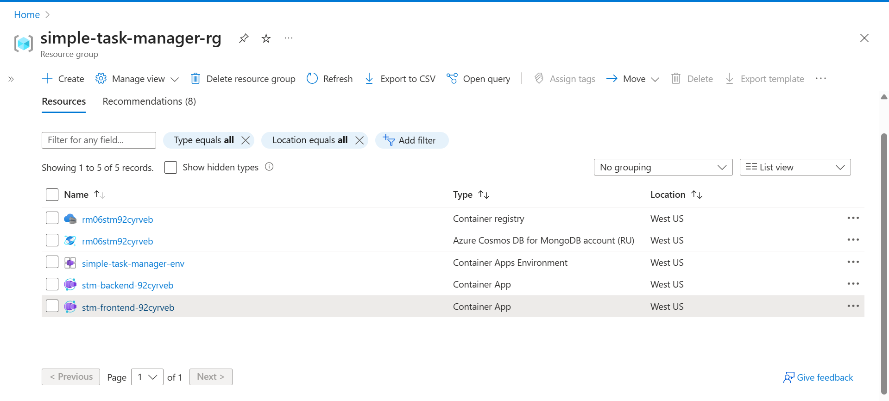
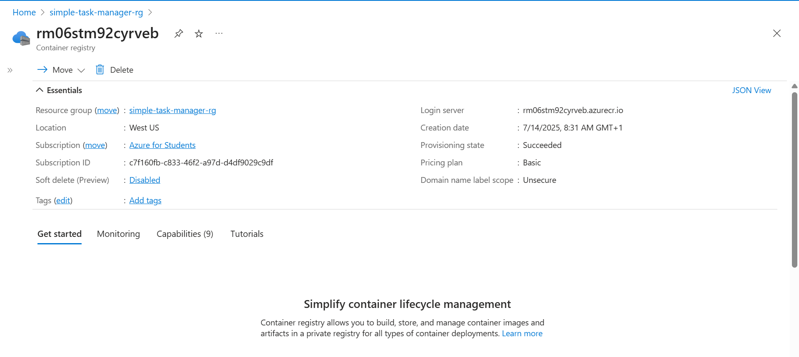
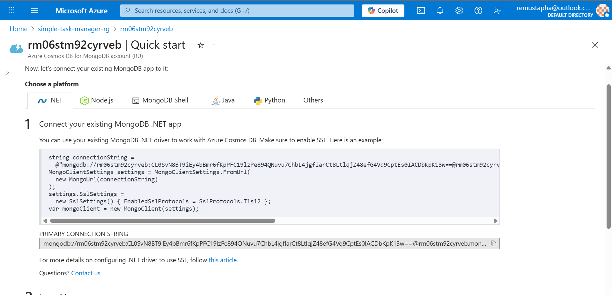
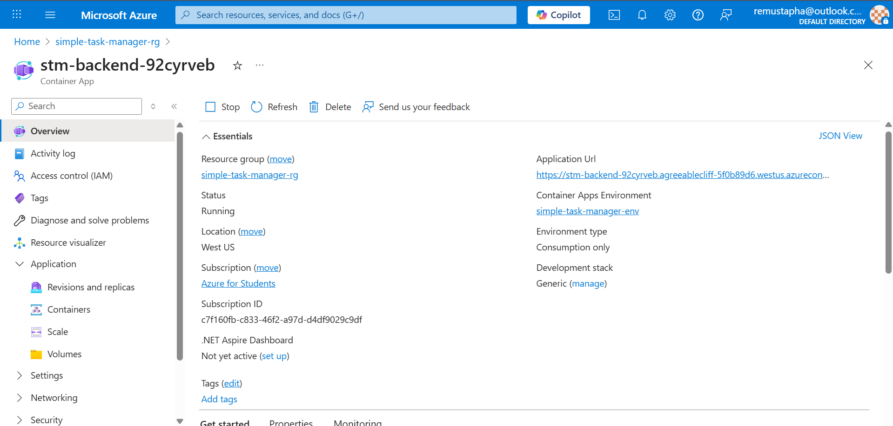
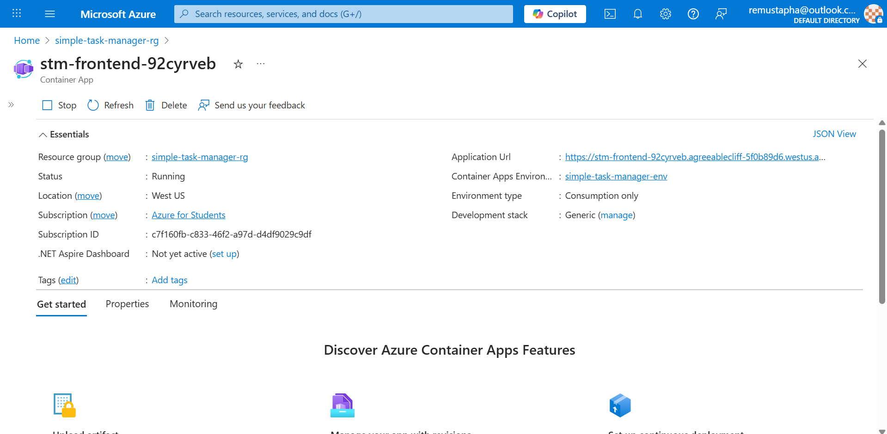

# Phase 2 - IaC, Containerization & Manual Deployment

## Live Public URLs

### Frontend Application URL:
https://stm-frontend-92cyrveb.agreeablecliff-5f0b89d6.westus.azurecontainerapps.io

### Backend Application URL:
https://stm-backend-92cyrveb.agreeablecliff-5f0b89d6.westus.azurecontainerapps.io

---

## Screenshots

### 1️⃣ Azure Resource Group

### 2️⃣ Azure Container Registry (ACR)

### 3️⃣ Azure CosmosDB

### 4️⃣ Azure Container Apps (Backend & Frontend)

---

## Peer Review Link

Not done:  
[Link to Peer Review Pull Request]()

---

## 📝 Reflection on IaC & Manual Deployment Challenges

### What I Learned:
- I now understand how to write Infrastructure as Code using **Terraform** to provision real cloud resources.
- I learned how to build and push Docker images to **Azure Container Registry (ACR)**.
- I experienced deploying applications to **Azure Container Apps** manually through the portal.

### Challenges I Faced:
- I accidentally committed a **CosmosDB connection string**, which triggered GitHub’s push protection. I learned how important secret management is.
- Figuring out the right order for provisioning (Resource Group → ACR → CosmosDB → Container App) took time.
- Setting up container permissions to pull from ACR required attention to **role assignments**.

### How I Overcame Them:
- I fixed secret leaks by rewriting history and cleaning commits.
- I read **Azure’s documentation** carefully to understand each resource dependency.
- I verified deployments manually through the Azure Portal after pushing my images.

---

## 🚀 Project Status:
Application is successfully running live  
Infrastructure is fully provisioned using Terraform  
Containerization and registry processes are complete  
Peer review is not yet done